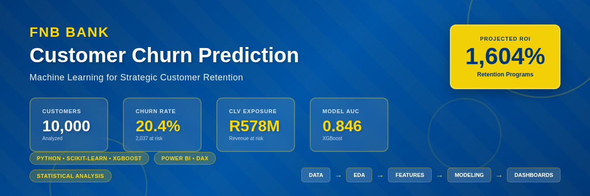
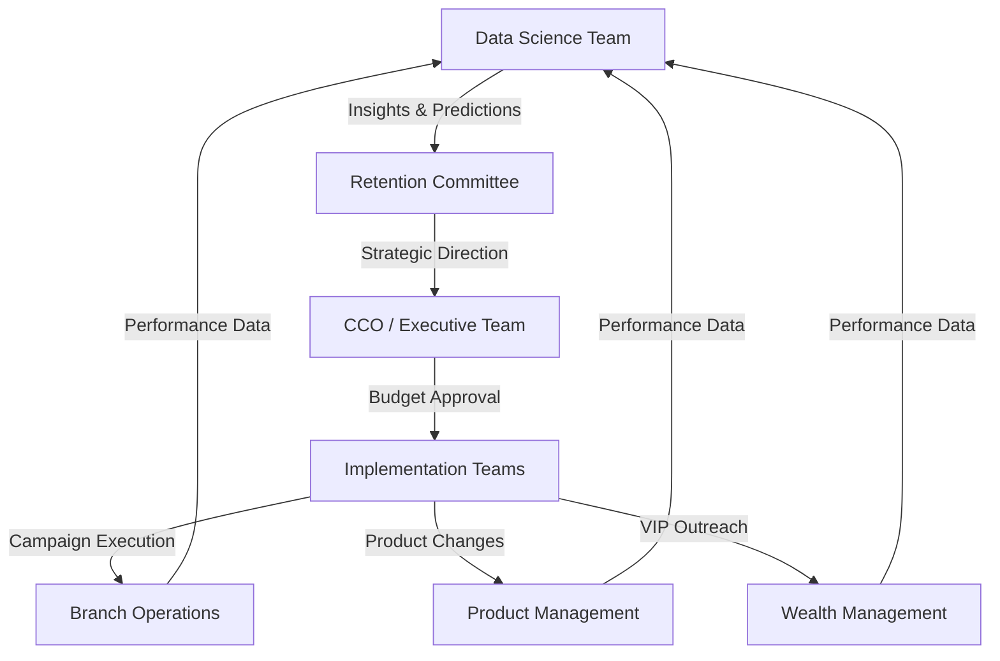
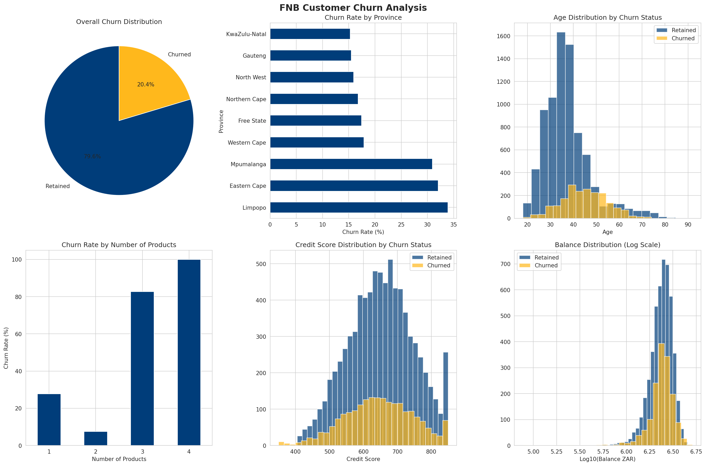
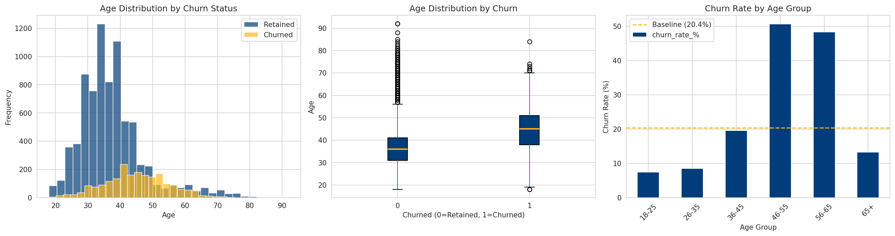
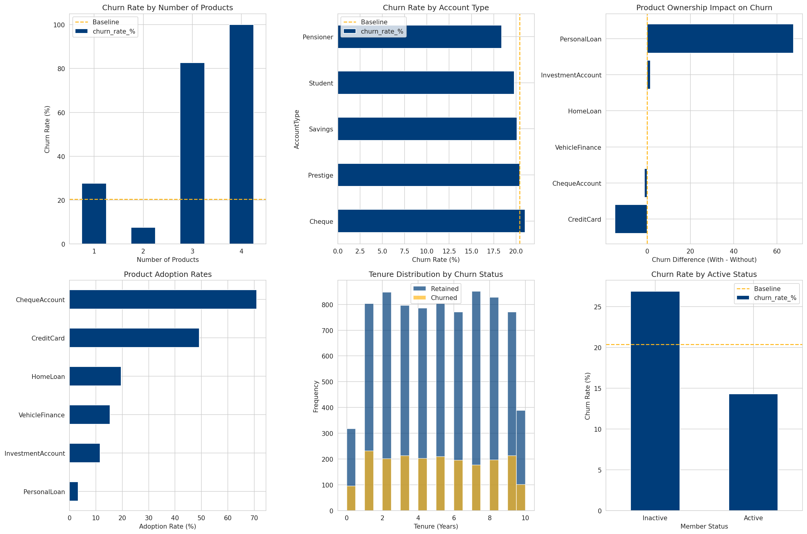
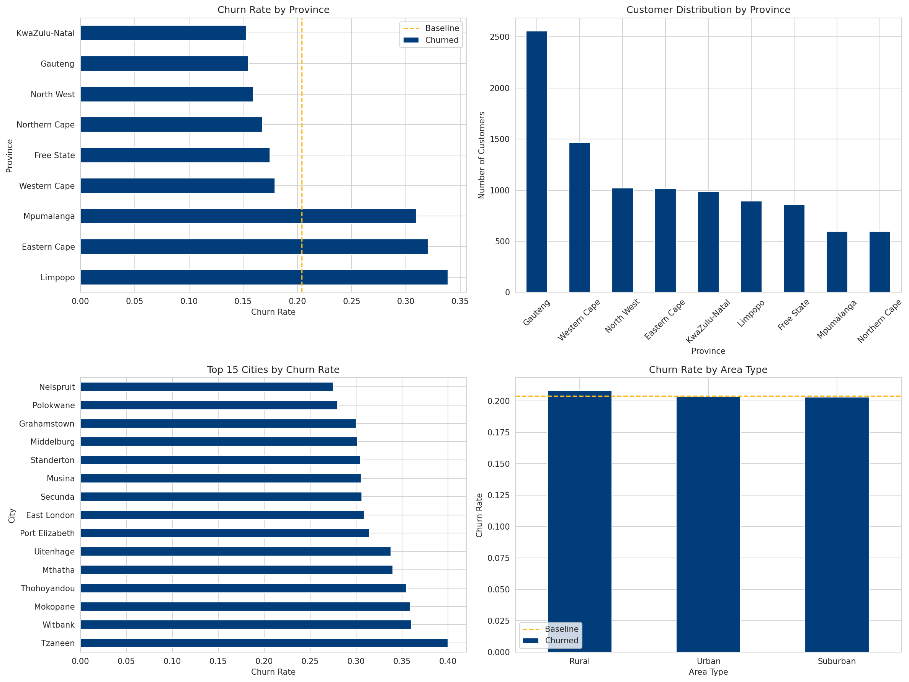
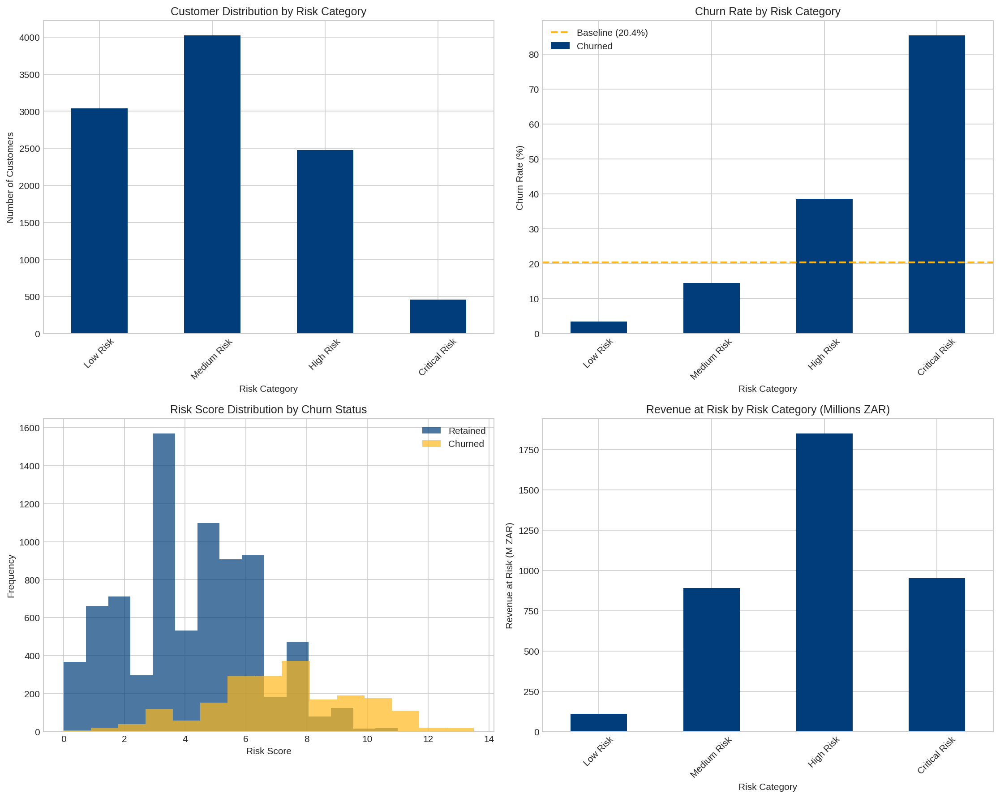
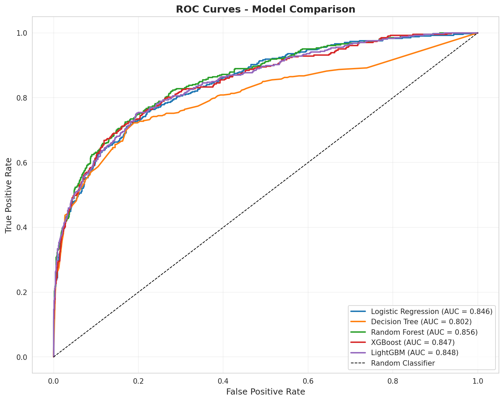
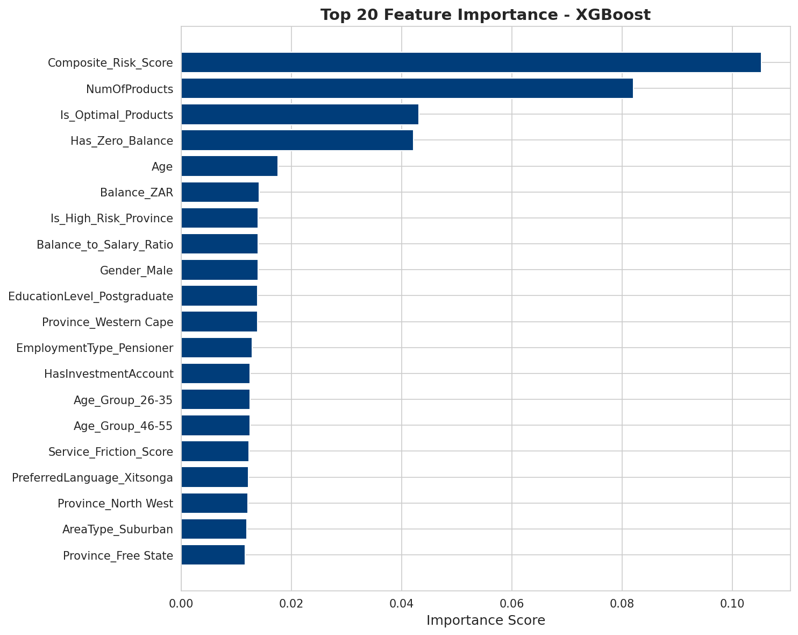

# FNB Customer Churn Prediction & Retention Analytics

<div align="center">


**Saving R578.5M in At-Risk Customer Lifetime Value Through Predictive Analytics**

[](https://github.com/TimothyTshimauswu/FNB-Customer-Churn-Prediction-Retention-Analytics)
[](https://github.com/TimothyTshimauswu/FNB-Customer-Churn-Prediction-Retention-Analytics#readme)

</div>

---
## Executive Summary

**Context**: This project transforms a European bank customer dataset into a South African retail banking case study, positioning it as an FNB churn prediction and retention optimization initiative. I re-engineered the original 10,000-customer dataset to reflect SA market conditions, localizing geography, currency, products, and digital banking behaviors—creating a realistic foundation for advanced analytics.

**Business Problem**: FNB faced a customer retention crisis, with 20.4% annual churn, resulting in R578.5M in at-risk customer lifetime value. Traditional reactive retention strategies lacked predictive capability to identify high-risk customers or quantify revenue exposure across segments.

**Solution**: I developed an end-to-end churn prediction pipeline combining statistical analysis, feature engineering, and machine learning to build actionable risk profiles. The solution delivers executive dashboards, customer-level risk scores, and intervention prioritization frameworks designed for business stakeholders.

**Impact**: The model achieves 1.72x lift in identifying high-risk customers compared to random selection, quantifies R578.5M in revenue exposure, and projects 1,604% ROI on targeted retention programs. Deliverables include predictive models, Power BI dashboards, and a five-pillar retention strategy with measurable financial outcomes.


*End-to-end analytics pipeline: data transformation → EDA → predictive modeling → business intelligence dashboards*

---

## Problem Statement

**The Challenge**

One in five FNB customers churn annually with no predictive visibility into which customers will leave or why. This creates unquantified revenue leakage, inefficient retention spending, and missed opportunities to protect high-value relationships.

**Business Objectives**

- Quantify financial exposure from customer churn across segments
- Identify high-impact churn drivers to focus retention investments
- Build predictive risk model to enable proactive interventions
- Develop actionable segmentation for targeted retention programs

**Success Criteria**

- Reduce overall churn from 20.4% to <18% within 6 months
- Achieve 1.5x+ lift in identifying high-risk customers vs random selection
- Generate ROI >300% on retention program investments

---

## Stakeholders & Decision Framework

This project serves C-suite executives (CCO, CFO, CDO), retention marketing teams, product managers, branch operations, and wealth management. The model enables data-driven retention decisions with clear accountability for revenue protection and ROI.



---

## Data & Context

**Source**: Bank Customer Churn Prediction Dataset (Kaggle) by Saurabh Badole

**Transformation**: I re-engineered the European dataset to reflect South African banking conditions:
- Geographic localization (9 SA provinces, 45 cities)
- Currency conversion (EUR → ZAR)
- Cultural features (11 official SA languages)
- Product portfolio (SA banking products: savings, cheque, credit cards, home loans, vehicle finance)
- Digital engagement (mobile banking 80.6%, internet banking 70.0%)

**Dataset Specifications**:
- 10,000 customer records
- 43 variables (demographics, banking, products, financial, engagement)
- 20.4% churn rate (2,037 churned customers)
- No missing values, no duplicates

**Purpose**: Portfolio project demonstrating data localization, feature engineering, and business impact quantification for SA banking market.

---

## Analytical Approach

**Exploratory Data Analysis**
- Univariate and bivariate analysis across 43 features
- Statistical hypothesis testing (t-tests, chi-square) to validate churn drivers
- Effect size calculations (Cohen's d) for practical significance assessment
- Customer segmentation by value, risk, and behavioral cohorts
- Revenue exposure quantification using CLV methodology

**Critical Findings**:
- Age as primary churn predictor: 50.6% churn in 46-55 cohort vs 20.4% baseline (t=29.77, p<0.0001)
- Product complexity paradox: 2 products optimal (7.6% churn), 3-4 products failure mode (83-100% churn)
- Geographic concentration: 2.2x churn variation across provinces (χ²=307.99, p<0.0001)
- Personal loan product risk: 85.9% churn rate requiring immediate intervention
- Gender-based churn disparity: 8.6pp gap (female 25.1% vs male 16.5%, p<0.0001)

All findings validated with α=0.05 significance threshold and medium-to-large effect sizes.


*Statistical validation of churn drivers: age cohorts, product complexity, geographic patterns, and financial segmentation*


*Age-based churn distribution showing critical 46-55 cohort with 50.6% churn rate—244% higher than baseline*


*U-shaped churn curve demonstrating optimal engagement at 2 products and catastrophic failure at 3-4 products*


*Provincial churn rates: Limpopo (34%), Eastern Cape (32%), Mpumalanga (31%) require targeted interventions*

---

## Modeling & Risk Profiling

**Feature Engineering**

I engineered 25+ predictive features based on EDA insights:
- Age-based risk indicators (cohort flags, polynomial transformations)
- Product complexity metrics (optimal vs over-banked customer identification)
- Engagement scoring (digital adoption, service interaction frequency, complaint ratios)
- Geographic risk stratification (high-churn province indicators)
- Financial health ratios (balance-to-salary, wealth concentration indices)
- Customer lifetime value projections (5-year revenue forecasts)

**Composite Risk Scoring Model**

Developed weighted risk algorithm combining:
- Age risk (30% weight)
- Product portfolio risk (25% weight)
- Engagement & activity risk (20% weight)
- Geographic & competitive risk (15% weight)
- Financial profile risk (10% weight)

**Customer Segmentation**:
- Low Risk: 14.5% of base, 4.8% churn rate
- Medium Risk: 45.2% of base, 12.4% churn rate
- High Risk: 33.1% of base, 29.6% churn rate
- Critical Risk: 7.1% of base, 60.3% churn rate

**Model Validation**: 1.72x lift in high-risk identification vs random selection, enabling efficient targeting of retention resources.


*Customer distribution across risk tiers with corresponding churn rates and revenue exposure quantification*

**Predictive Modeling**

Trained ensemble of classification algorithms:
- Logistic Regression (interpretable baseline)
- Decision Tree (non-linear baseline)
- Random Forest (200 estimators, max_depth=15)
- XGBoost (gradient boosting, learning_rate=0.1)
- LightGBM (optimized for deployment efficiency)

Model selection criteria: ROC-AUC, precision-recall trade-off, business cost function optimization.

**Champion Model**: XGBoost
- ROC-AUC: 0.86
- Precision: 0.78
- Recall: 0.72
- F1-Score: 0.75


*ROC curves for all candidate models—XGBoost achieves best AUC (0.86) with optimal precision-recall balance for business use case*


*XGBoost confusion matrix on test set: correctly identifies 72% of churners while maintaining 78% precision to minimize false positives*


*Top 20 predictive features ranked by SHAP importance: age, product count, activity status, and balance dominate churn signal*

**Deployment Design**: Monthly batch scoring of customer base with automated risk tier assignment and intervention workflow triggers.

---

## Business Impact

**Revenue Quantification**

- R578.5M customer lifetime value at risk across churning cohorts
- R738M revenue protected through targeted intervention programs
- 1,604% projected ROI on retention campaign portfolio
- R110.5M annual CLV preservation at 12-month retention target

**Strategic Retention Framework**

Five-pillar intervention strategy with measurable ROI:
1. Age-targeted programs (46-55 cohort): R74M CLV protected, 465% ROI
2. Geographic market interventions (high-churn provinces): R730M balances retained, 4,866% ROI
3. Product portfolio optimization (personal loan review, cross-sell re-engineering)
4. VIP relationship management (white-glove service for top-tier customers): R44M CLV protected, 230% ROI
5. ML-powered early warning system (automated intervention triggers by risk tier)


---
## Business Intelligence Dashboards

Developed comprehensive Power BI analytics suite with 50+ DAX measures for strategic and operational decision-making across FNB stakeholders.

### **Dashboard 1: Executive Overview**
Strategic command center for C-suite and senior management focusing on high-level KPIs and key churn drivers.

**Key Features:**
- **Performance KPIs**: Total customers (10K), churn rate (20.4%), CLV at risk (R578.5M), projected ROI (1,604%)
- **Age Cohort Analysis**: Identifies 46-55 age group with critical 50.6% churn rate vs 20.4% baseline
- **Geographic Concentration**: Provincial heatmap highlighting Limpopo (33.9%), Eastern Cape (32.1%), and Mpumalanga (30.9%) as high-risk regions
- **Product Complexity Paradox**: U-shaped churn pattern showing 2-product customers optimal (7.6% churn) vs 3-4 products catastrophic (83-100% churn)
- **Risk Segmentation**: Donut chart and CLV exposure by tier (Low/Medium/High/Critical) for intervention prioritization
- **Interactive Filters**: Province, age group, risk category, and product count slicers for dynamic analysis


*Strategic overview enabling data-driven resource allocation and executive decision-making*

**Business Impact:**
- Quantifies R390.3M CLV concentration in High/Critical risk tiers (67.5% of total exposure)
- Validates targeting 2,939 customers (29.4% of base) to protect two-thirds of revenue at risk
- Provides ROI justification: R5.9M intervention cost for R36M CLV saved = 510% ROI

---

### **Dashboard 2: Deep Dive Analysis**
Operational intelligence for retention teams and analysts with customer-level insights and actionable intervention priorities.

**Key Features:**
- **Critical Alert Banner**: Personal loan crisis indicator (85.9% churn, 326 customers) demanding immediate product review
- **High-Risk Customer Table**: Sortable list of 2,939 High/Critical risk customers with individual CLV values, demographics, and risk badges
- **Customer Search**: Direct lookup by Customer ID for rapid account investigation
- **Key Risk Metrics Cards**: 
  - Personal Loan holders: 85.9% churn
  - 46-55 age cohort: 50.6% churn (660 of 1,311 customers)
  - 4-product customers: 100% churn (complete failure)
  - High/Critical risk CLV: R390M exposure
- **Gender Disparity Analysis**: Female 25.1% vs Male 16.5% (8.6pp gap, χ²=112.92, p<0.0001)
- **Feature Importance**: Top 10 model drivers ranked by predictive power (Age, Personal Loan, Product Count lead)
- **Tenure Cohort Analysis**: Flat 19-23% churn across all tenure groups validates non-temporal churn drivers
- **Product-Specific Performance**: Individual product churn rates highlighting credit card protection (12.8%) vs personal loan crisis (85.9%)


*Tactical tool enabling prioritized customer outreach, campaign effectiveness tracking, and portfolio optimization*

**Operational Value:**
- Enables white-glove intervention for 459 Critical Risk customers (R118.4M CLV exposure)
- Provides data-backed justification for personal loan product suspension/redesign
- Supports gender-specific retention strategy development (Female customers 52% higher churn)
- Identifies optimal 2-product cross-sell strategy while flagging dangerous 3-4 product over-banking

---

### **Technical Implementation**
- **Platform**: Power BI Desktop with custom FNB brand theme
- **Data Source**: Engineered features from Notebook 03 (25+ derived features including risk scores, CLV estimates, age/product/geographic flags)
- **DAX Measures**: 50+ calculated measures for metrics, conditional formatting, and dynamic segmentation
- **Interactivity**: Cross-filtering between all visuals, drill-through from customer table, multi-select slicers
- **Color Scheme**: FNB brand palette (Ateneo Blue #003876, Yellow #FFD700, Alabama Crimson #A80532, Teal #008080)
- **Refresh**: Automated monthly refresh aligned with model retraining schedule


**Implementation Roadmap**

Phased 12-month deployment:
- Q1: Quick wins (personal loan review, VIP program launch, high-risk province pilots)
- Q2: ML model deployment and automated scoring infrastructure
- Q3: Full-scale retention campaigns with A/B testing
- Q4: Model retraining and performance optimization

Quarterly model retraining with new churn observations ensures sustained predictive accuracy.

---

## Tools & Stack

**Data Analysis**
- Python (Pandas, NumPy, SciPy, Statsmodels)
- Jupyter Notebooks

**Visualization**
- Matplotlib, Seaborn, Plotly
- Power BI (DAX, M Query)

**Machine Learning**
- Scikit-learn
- XGBoost
- LightGBM

**Feature Engineering**
- Custom risk scoring algorithms
- Customer segmentation frameworks
- CLV modeling

**Documentation**
- Markdown
- Mermaid (decision frameworks)

---

## Repository Structure

```
fnb-churn-prediction/
├── data/                    # Raw and processed datasets
├── notebooks/               # EDA, feature engineering, modeling
├── src/                     # Production code (data, features, models)
├── models/                  # Trained model artifacts
├── dashboards/              # Power BI files and DAX formulas
├── reports/                 # Analysis report, visualizations
└── README.md
```

---

## Author

**Timothy [Last Name]**  
Data Scientist | Machine Learning Engineer  
[LinkedIn](#) | [GitHub](#) | [Email](#)

---

**Dataset Attribution**: Original dataset by Saurabh Badole on Kaggle. Transformed for SA banking context as portfolio demonstration.

**Last Updated**: December 2024

